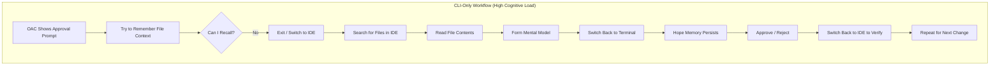
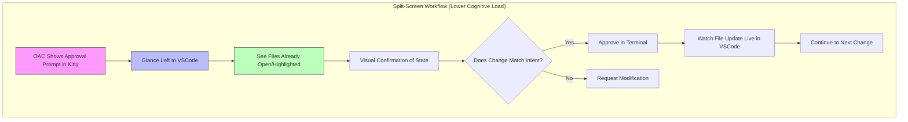
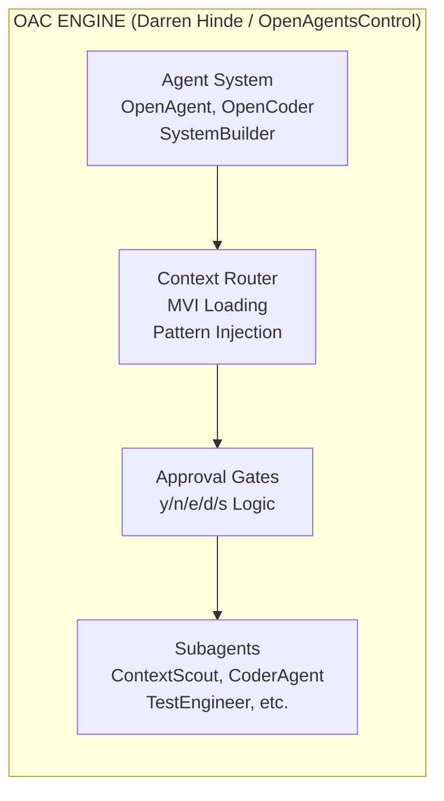
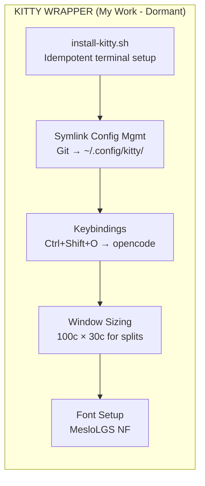
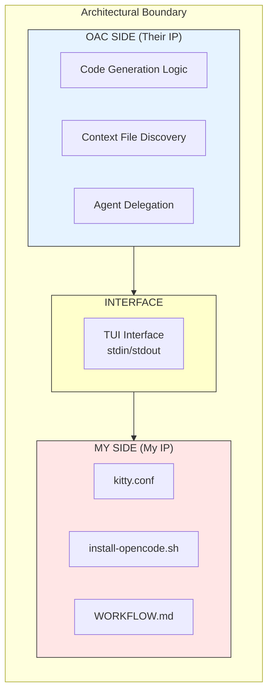
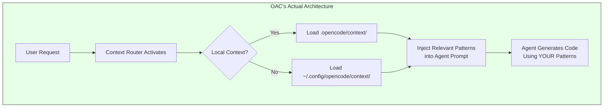
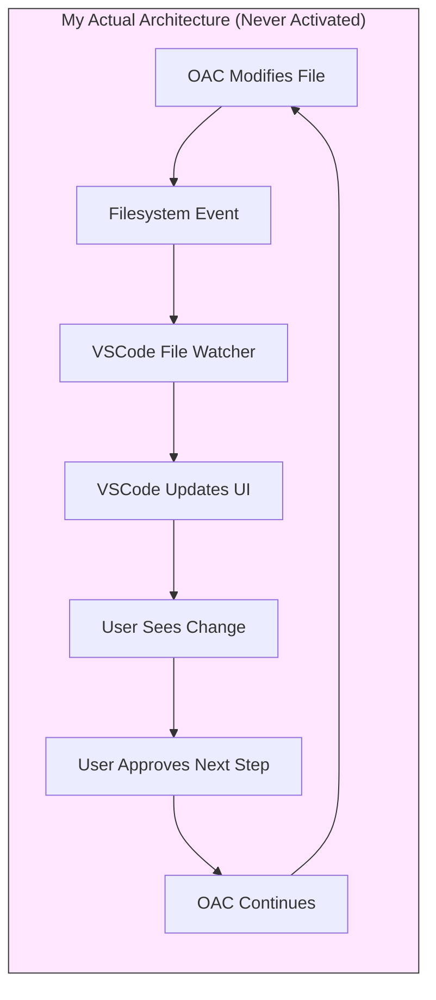
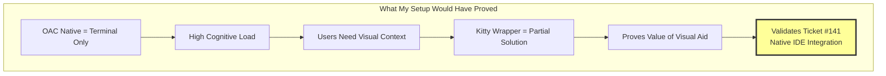

# Why I Tried to Build the Kitty/OAC Integration
## A Psycho-Technical Post-Mortem of a Dormant Prototype

**Status:** Failed / Non-Operational / Abandoned
**Date of Analysis:** 2026-03-15
**Analyst Perspective:** Psycho-Technical Systems Analysis
**Tense:** Conditional (reflecting intention vs. reality)

---

## 1. The Cognitive Bottleneck: Why This Was Supposed to Matter

### 1.1 The CLI Memory Tax on Technical Managers

As a Technical Manager/Architect, my cognitive workflow would ideally span multiple abstraction layers simultaneously:
- **Strategic:** System architecture, team coordination, technical debt assessment
- **Tactical:** Code review, pattern enforcement, quality gates
- **Operational:** Debugging, deployment oversight, incident response

**The Problem with Pure CLI Tools (like native OAC):**

When OAC would present an approval gate in a terminal-only interface, my brain would be forced to perform expensive context switches:

**Cognitive Costs I Would Experience:**
- **Working Memory Overload:** Holding file contents in mind while reading terminal output
- **Context Switching Penalty:** ~23 minutes to regain deep focus after interruption (research-backed)
- **Decision Fatigue:** Approving changes "blind" because verification was too expensive
- **Spatial Disorientation:** Losing track of which files were modified where

### 1.2 The Intended Solution: Visual Spatial Memory as Prosthesis

My Kitty + VSCode split-screen setup was designed to shift the cognitive load from **terminal memory** to **visual spatial memory**:

**The Cognitive Shift I Was Attempting:**

| Resource | CLI-Only Mode | Split-Screen Mode |
|----------|--------------|-------------------|
| **Memory Type** | Working memory (limited, ~4 items) | Visual spatial memory (virtually unlimited) |
| **Context Switching** | High (terminal ↔ IDE repeatedly) | Low (eyes move, head stays still) |
| **Verification Cost** | Expensive (switch apps, navigate) | Cheap (glance left) |
| **Decision Confidence** | Low (approving from memory) | High (approving from visual evidence) |

**The Hypothesis:** By anchoring OAC's terminal interface next to VSCode's file explorer, I would create a "cognitive prosthesis" where the IDE's visual state would serve as an external memory buffer. My brain would offload the burden of remembering file states to the persistent visual display.

---

## 2. Strict Separation of IP: What I Actually Built vs. OAC

### 2.1 The OAC Engine (Not My Work)

The OAC framework would handle:
- **MVI (Minimal Viable Information):** Loading only relevant context files (<200 lines)
- **Context Routing:** Discovering and injecting patterns into agent prompts
- **Approval Gates:** The core logic for `y/n/e/d/s` prompts
- **Agent Orchestration:** Delegating to subagents like ContextScout, CoderAgent
- **Model Abstraction:** Supporting Claude, GPT, Gemini through unified interface

### 2.2 My Kitty Wrapper (What I Actually Built)

My contribution would have been purely environmental/orchestrational:

### 2.3 The Boundary Line

**What I Should NOT Receive Credit For:**
- ❌ The MVI principle
- ❌ Context file routing
- ❌ The approval gate concept
- ❌ Any agent logic
- ❌ The `/add-context` command

**What I would have Received Credit For (though it never worked):**
- ✅ Bash scripts for terminal orchestration
- ✅ Symlink-based configuration management
- ✅ Split-screen workflow documentation
- ✅ Window sizing optimization for side-by-side layouts

---

## 3. Correction: Context Routing vs. Scraping

### 3.1 My Previous Error

In earlier analysis, I mistakenly suggested OAC would use "scraping" to discover context. This was incorrect and misleading.

### 3.2 The Correct Architecture: MVI + Context Routing

**OAC would use targeted Context Routing, not scraping:**

**MVI Principle:** Only files explicitly defined in the context directory would be loaded, and only the relevant ones based on the task type.

### 3.3 My Kitty Addon's Architecture: Terminal Multiplexing + FS Sync

**My addon would NOT scrape either. It would rely on:**

1. **Terminal Multiplexing:** Kitty running alongside VSCode
2. **File System Synchronization:** VSCode's built-in file watching detecting changes made by OAC

### 3.4 Contrast with Roo Code

Unlike tools like **Roo Code** (which actively reads files via VSCode APIs), this setup would have been:
- **Passive:** VSCode watches; no active reading
- **External:** OAC runs in terminal, not inside IDE
- **Loosely Coupled:** No direct API integration

This clean separation was intentional — it would have kept OAC as a standalone tool while adding visual context.

---

## 4. The Strategic Value: What This Prototype Would Have Demonstrated

### 4.1 The Gap in OAC's UX

My failed experiment would have proven that (for a lot of users) **OAC needs native IDE integration** (Ticket #141) because:

1. **Terminal TUI is insufficient for complex workflows** — the approval gate mechanism requires visual file context
2. **Manual window management is fragile** — relying on users to snap windows is error-prone
3. **Context switching kills productivity** — even with my optimizations, the terminal↔IDE boundary would remain

### 4.2 This as a Functional Prototype

My Kitty wrapper would have served as a **poor man's IDE integration** — demonstrating the value proposition without requiring OAC to build native extensions:

**The Argument I Would Have Made:**

> "If even a fragile terminal wrapper improves the OAC experience, imagine what native VSCode/Cursor integration could achieve.

---

## 5. The Reality Check: A Chronicle of Failures

### 5.1 The Sequence of Failures

Despite the theoretical soundness of the architecture, this system **never achieved operational status**. Here is the honest chronicle:

```mermaid
flowchart TD
    subgraph FAILURE["Timeline of Failure"]
        A[Attempt 1: Kilocode] --> B[Opencode CLI Installed Successfully]
        B --> C[OAC Framework Failed to Load]
        C --> D[Agents Never Activated]

        D --> E[Attempt 2: Direct Opencode]
        E --> F[Same Result: CLI Works]
        F --> G[OAC Agents Still Non-Functional]

        G --> H[Attempt 3: Back to Kilocode]
        H --> I[Complete Failure]
        I --> J[Kitty Scripts Dormant]
        J --> K[No Working OAC Instance]
    end

    style FAILURE fill:#ffcccc,stroke:#333,stroke-width:2px
    style K fill:#ff6666,stroke:#333,stroke-width:3px
```

### 5.2 What Actually Worked vs. What Didn't

| Component | Status | Evidence |
|-----------|--------|----------|
| Kitty Installation | ✅ Functional | `install-kitty.sh` completed successfully |
| Symlink Config | ✅ Functional | `~/.config/kitty/` linked to repo |
| Opencode CLI | ⚠️ Partial | Binary installed, basic commands worked |
| OAC Framework | ❌ Non-Functional | Agents never loaded |
| Context Files | ❌ Never Populated | `/add-context` never executed successfully |
| Split-Screen Workflow | ❌ Never Activated | No working OAC to test with |

### 5.3 Why I Am Sharing This Failure

This "Kitty Addon" project has been **sleeping on my desk** for months. That is a waste. I am sharing this failed prototype with the community for three reasons:

1. **Inspiration:** Someone might see the cognitive architecture and build something better
2. **The Missing Link:** Perhaps someone will point out the obvious step I missed — why OAC agents wouldn't activate despite the CLI working
3. **Open Source Heritage:** Even failures contribute to the shared knowledge base

### 5.4 The Ultimate Lesson

My operational failure proves that **a DIY terminal wrapper is too fragile for production use** when the underlying tool (OAC) itself cannot be activated by the user. The sequence of failures — trying Kilocode, then direct Opencode, then Kilocode again — demonstrates that I was attempting to build UX infrastructure on top of a non-functional non-mastered foundation.

**This validates Ticket #141 (Native VSCode/Cursor Integration) as absolutely vital.**

Users like me need:
- ✅ Working IDE integration out of the box
- ✅ No manual terminal orchestration
- ✅ Guaranteed agent activation
- ✅ Support when things fail

My prototype, for all its theoretical elegance, could never provide these things because it was built on quicksand.

---

## Conclusion: The Intention vs. The Reality

| Aspect | What Was Intended | What Actually Happened |
|--------|------------------|------------------------|
| **Purpose** | Cognitive prosthesis for OAC | Dormant scripts, no OAC to assist |
| **Status** | Production-ready wrapper | Failed prototype |
| **OAC Integration** | Seamless split-screen workflow | OAC agents never loaded |
| **User Experience** | Low cognitive load | Frustrating debugging attempts |
| **Community Value** | Best practice example | Cautionary tale |

**The scripts exist. The configuration is sound. The philosophy is valid. But the integration never breathed.**

This document serves as a tombstone for an idea that should have worked, would have helped, but didn't — and an argument for why OAC needs to take IDE integration seriously, please.

---

*Files referenced in this analysis:*
- [`05-DESKTOPS/kitty/install-kitty.sh`](05-DESKTOPS/kitty/install-kitty.sh) — Terminal orchestration script
- [`05-DESKTOPS/kitty/opencode/install-opencode.sh`](05-DESKTOPS/kitty/opencode/install-opencode.sh) — OAC installation attempt
- [`05-DESKTOPS/kitty/opencode/WORKFLOW.md`](05-DESKTOPS/kitty/opencode/WORKFLOW.md) — Split-screen workflow documentation
- [`05-DESKTOPS/kitty/kitty.conf`](05-DESKTOPS/kitty/kitty.conf) — Terminal configuration
